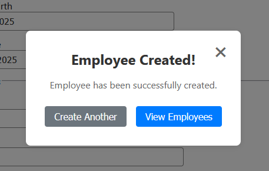
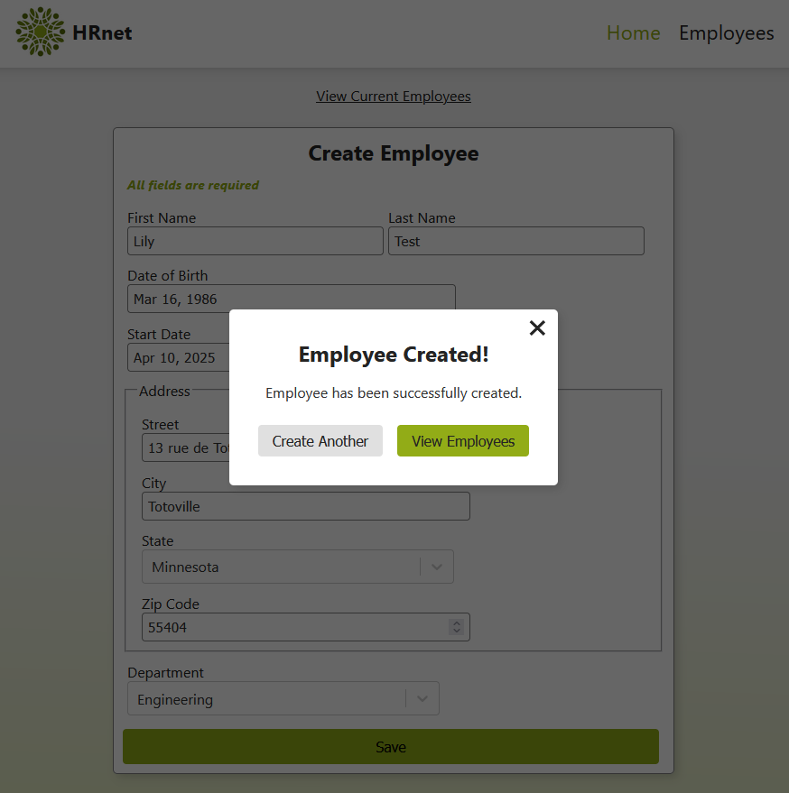

# react-mj-modal-basic

Une modale React simple et réutilisable.

## Aperçu

Visuel de base:

<br><br>

Exemple après personnalisation:



## Installation

```bash
npm install react-mj-modal-basic
```

## Prérequis

- React 18.0.0 ou supérieur
- React DOM 18.0.0 ou supérieur
- Node.js 16.0.0 ou supérieur

## Utilisation

```jsx
import { useState } from 'react';
import { Modal } from 'react-mj-modal-basic';
import 'react-mj-modal-basic/dist/react-mj-modal-basic.css';

function App() {
  const [isOpen, setIsOpen] = useState(false);

  // Fonction de fermeture
  const handleClose = () => {
    setIsOpen(false);
    // Autres actions possibles :
    // - Réinitialiser un formulaire
    // - Sauvegarder des données
    // - Nettoyer des états
    // - Rediriger vers une autre page
  };

  return (
    <div>
      <button onClick={() => setIsOpen(true)}>
        Ouvrir la modale
      </button>

      <Modal
        isOpen={isOpen}
        onClose={handleClose}
        title="Titre de la modale"
        message="Contenu de la modale"
        primaryButton={
          text: "Texte du bouton",
          onClick: fonctionPrincipale()
        }
        secondaryButton={{
          text: "Texte du bouton",
          onClick: fonctionSecondaire()
        }}
      />
    </div>
  );
}
```

### Boutons optionnels

Les boutons sont entièrement optionnels. Vous pouvez :

- Ne pas inclure les props `primaryButton` et `secondaryButton` pour avoir une modale sans boutons
- N'inclure que `primaryButton` pour avoir un seul bouton

Exemple sans boutons :

```jsx
<Modal
  isOpen={isOpen}
  onClose={handleClose}
  title="Titre de la modale"
  message="Contenu de la modale"
/>
```

Dans tous les cas, la modale contient un bouton de fermeture (✖) en haut à droite.

### Fermeture de la modale

La modale peut être fermée de trois manières :

1. En cliquant sur le bouton "x" en haut à droite
2. En cliquant en dehors de la modale (sur l'overlay)
3. En utilisant les boutons personnalisés (si configurés pour appeler `onClose`)

Dans tous les cas, la fonction `onClose` fournie par le composant parent sera appelée.

La fonction `onClose` doit être définie pour :

- Fermer la modale (en mettant `isOpen` à `false`)
- Gérer toute logique supplémentaire nécessaire (réinitialisation, sauvegarde, etc.)

(via `handleClose()` dans l'exemple présenté plus haut)

### Import du CSS

Le CSS doit être importé séparément dans votre application. Ajoutez cette ligne dans le composant utilisant la modale ou votre fichier principal (généralement `main.jsx` ou `App.jsx`) si plusieurs composants l'utilisent:

```javascript
import "react-mj-modal-basic/dist/react-mj-modal-basic.css";
```

### Personnalisation CSS

La modale utilise les classes CSS suivantes que vous pouvez surcharger dans votre projet :

```css
.modal-overlay    /* Fond semi-transparent */
.modal-content    /* Conteneur principal de la modale */
.modal-close      /* Bouton de fermeture (✖) */
.modal-title      /* Titre de la modale */
.modal-message    /* Message de la modale */
.modal-buttons    /* Conteneur des boutons */
.modal-button     /* Style de base des boutons */
.modal-button.primary    /* Style du bouton principal */
.modal-button.secondary; /* Style du bouton secondaire */
```

Pour personnaliser ces styles, vous pouvez :

1. Utiliser une spécificité CSS plus élevée :

```css
/* Dans votre fichier CSS */
.your-component .modal-content {
  background-color: #your-color;
  border-radius: 12px;
}
```

2. Utiliser `!important` (à utiliser avec précaution) :

```css
.modal-content {
  background-color: #your-color !important;
}
```

## Props

| Prop            | Type     | Requis | Description                                                                              |
| --------------- | -------- | ------ | ---------------------------------------------------------------------------------------- |
| isOpen          | boolean  | Oui    | Contrôle l'affichage de la modale                                                        |
| onClose         | function | Oui    | Fonction appelée lors de la fermeture (doit gérer la fermeture et les actions associées) |
| title           | string   | Oui    | Titre de la modale                                                                       |
| message         | string   | Oui    | Message de la modale                                                                     |
| primaryButton   | object   | Non    | Configuration du bouton principal (optionnel)                                            |
| secondaryButton | object   | Non    | Configuration du bouton secondaire (optionnel)                                           |
